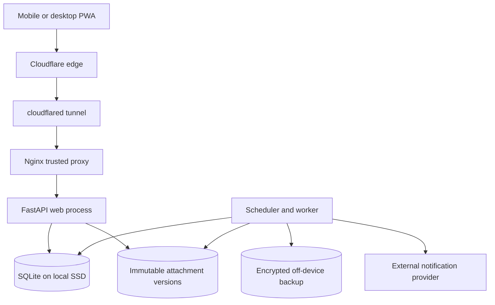
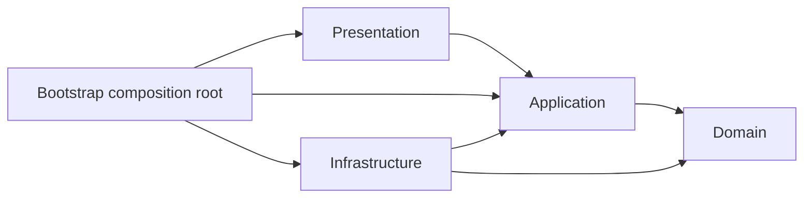
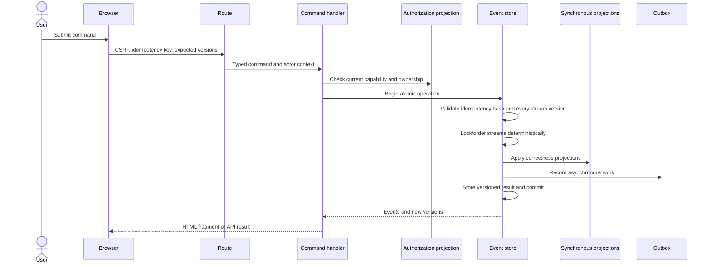
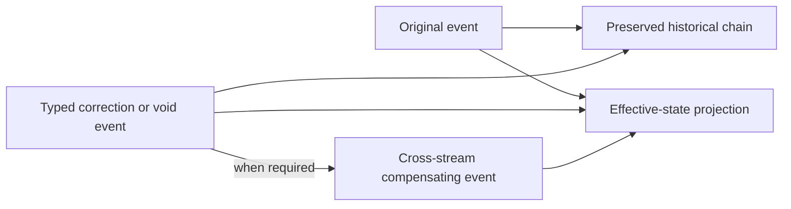
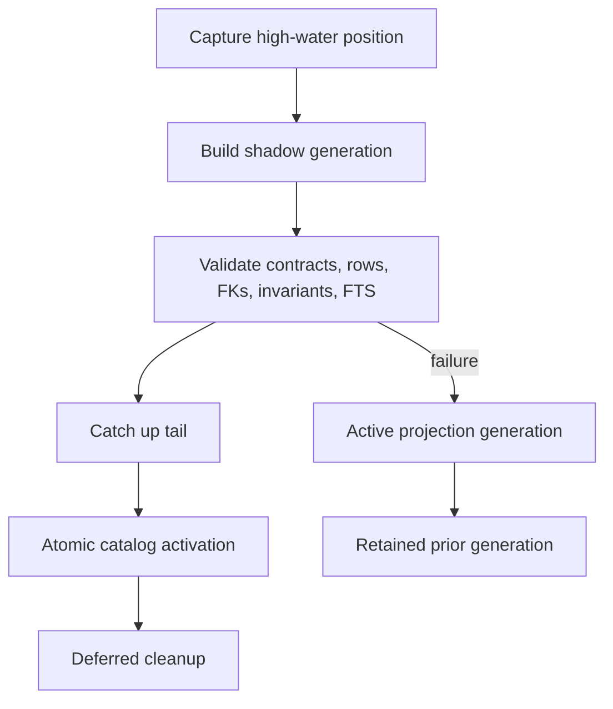
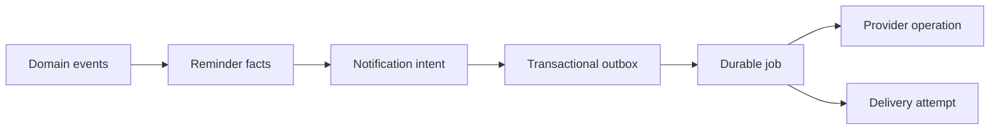
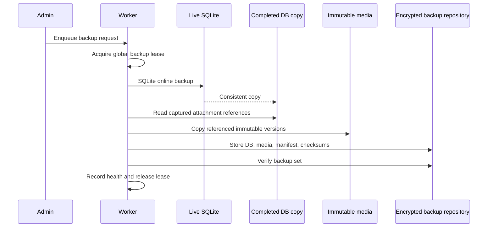
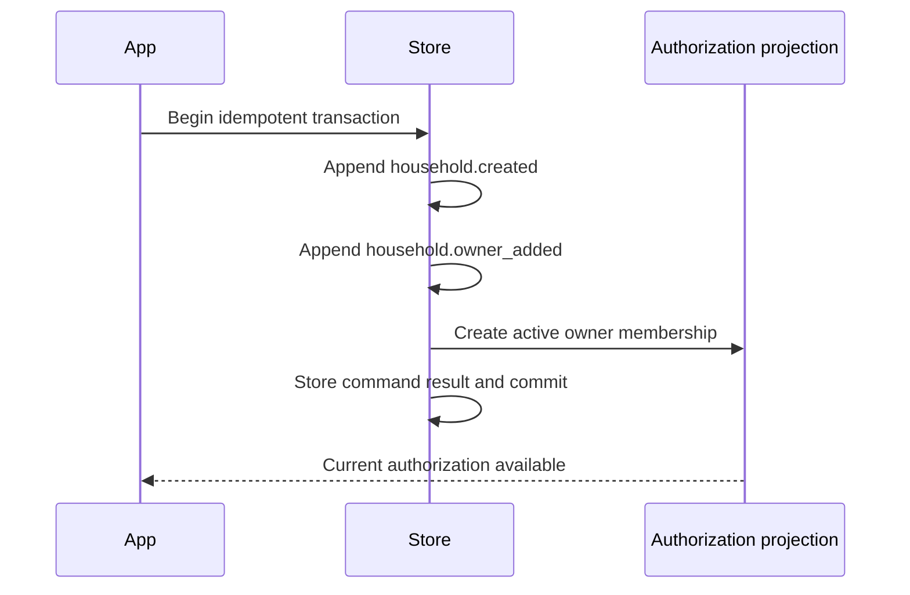
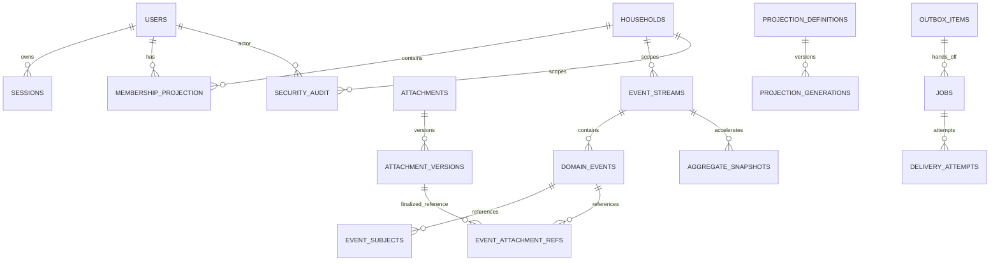

# Final Architecture Diagrams

## Deployment context

## Dependency direction

## Command and multi-stream append

## Correction and compensation

## Projection rebuild

## Reminder-to-delivery pipeline

## Backup and restoration

## Household bootstrap

## Logical entity relationships

