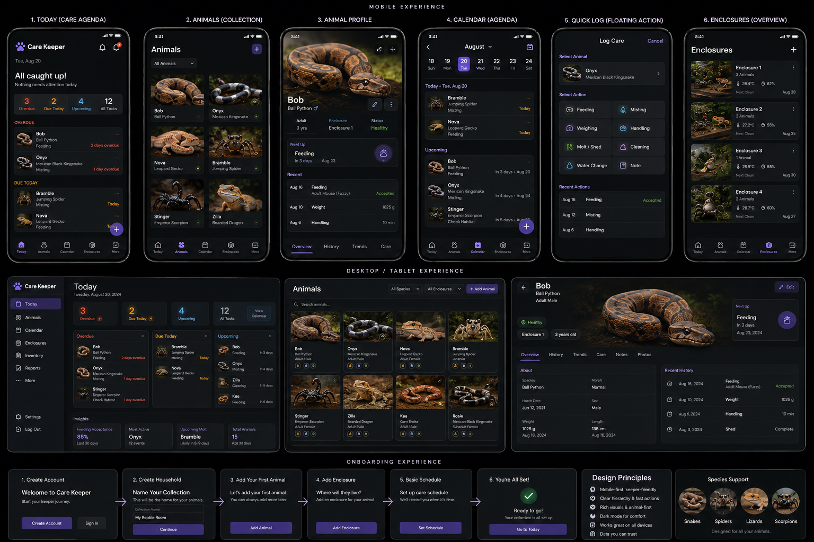

# Care Keeper owner-approved visual target

Status: **authoritative owner UX acceptance artifact**

The owner supplied this board on September 14, 2026 as the binding visual target for Care Keeper.
Its SHA-256 is
`b9fd2f1aee5fb98bfb812cae72b9972f0c2b240cf24eb7cd33ac8ae7129b2970`.

Future work must preserve its recognizable product character: photo-first animal identity, compact
dark cards, restrained purple accents, dense readable hierarchy, bottom navigation on mobile,
sidebar navigation and genuinely wide compositions on desktop, image-led profiles and habitats,
and quick care workflows. Functional acceptance, automated tests, accessibility checks, or the
absence of overflow do not supersede this visual target.

The board governs presentation, not domain facts. Care Keeper must not fabricate telemetry,
handling records, health classifications, or other facts merely because an example appears in the
board. See the [pre-implementation visual audit](visual-fidelity-audit.md) for the explicit mapping
between its examples and Care Keeper's real capabilities.
